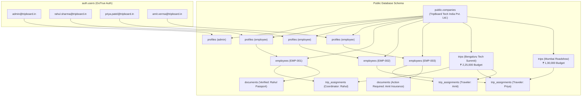

# Implementation Plan: Demo Admin & Employee Accounts Setup

**Target Branch:** `feature/framework-migration`  
**Stage:** Demo Accounts & Seed Data Setup  
**Status:** Pending User Approval  

---

## 1. Goal Description

Establish a production-ready, fully authenticated demo environment on the `feature/framework-migration` branch for TripBoard. This setup provisions:
1. **1 Demo Company:** `TripBoard Tech India Pvt. Ltd.` (INR currency, `Asia/Kolkata` timezone).
2. **1 Demo Admin Account:** Full management privileges for the Admin Suite (`/admin`), employee directory, budget approvals, and trip planning.
3. **3 Demo Employee Accounts:** Distinct corporate roles and traveler personas (including a designated Trip Coordinator) for Employee Portal (`/employee/dashboard`, `/employee/documents`, and Coordinator Hub).
4. **Realistic Sample Trips & Documents:** Multi-traveler itineraries with Group & Individual ₹ budget allocations and travel documents (passports, tickets, pending items) to showcase the application's features immediately upon login.
5. **Schema Alignment:** Incorporate the non-recursive PostgreSQL RLS policies into `database/schema.sql` so the branch matches the live database.

---

## 2. User Review Required

> [!NOTE]
> All 4 demo accounts will be created with pre-confirmed email addresses and a consistent, secure default password (`Demo@1234`) for seamless testing without email verification hurdles.

> [!IMPORTANT]
> The seed script uses PostgreSQL's native `pgcrypto` (`crypt` and `gen_salt('bf')`) directly against `auth.users`, ensuring the Supabase GoTrue Auth service authenticates all demo credentials out-of-the-box.

---

## 3. Demo Credentials & Account Architecture

| Persona | Name | Email | Password | Role | Employee Code | Department & Designation | Phone (India +91) |
|---|---|---|---|---|---|---|---|
| **Admin** | Vikramaditya Singhania | `admin@tripboard.in` | `Demo@1234` | `admin` | *N/A* | Operations / Management | `+91 98765 43210` |
| **Employee 1 (Coordinator)** | Rahul Sharma | `rahul.sharma@tripboard.in` | `Demo@1234` | `employee` | `EMP-001` | Engineering · Lead Architect | `+91 98111 22334` |
| **Employee 2 (Traveler)** | Priya Patel | `priya.patel@tripboard.in` | `Demo@1234` | `employee` | `EMP-002` | Product · Senior PM | `+91 98222 33445` |
| **Employee 3 (Traveler)** | Amit Verma | `amit.verma@tripboard.in` | `Demo@1234` | `employee` | `EMP-003` | Sales · Enterprise Executive | `+91 98333 44556` |

---

## 4. Architecture & Data Flow



---

## 5. Proposed Changes

### Database & Seed Layer

#### `[MODIFY]` `database/schema.sql`
- Incorporate `public.get_my_assigned_trip_ids()` `SECURITY DEFINER` function.
- Update `trips_select_policy` and `assignments_select_policy` to maintain non-recursive RLS integrity on the `feature/framework-migration` branch.

#### `[NEW]` `database/seed_demo_accounts.sql`
- Enables `pgcrypto` extension.
- Creates or retrieves `TripBoard Tech India Pvt. Ltd.` in `public.companies`.
- Inserts/upserts 4 accounts into `auth.users` with encrypted passwords (`crypt('Demo@1234', gen_salt('bf'))`), confirmed email timestamps, and user metadata.
- Links `public.profiles` records to the company with assigned roles (`admin` vs `employee`).
- Populates `public.employees` records for Rahul Sharma, Priya Patel, and Amit Verma with codes, phone numbers, and departments.
- Seeds 2 realistic business trips:
  1. **Q4 Tech Architecture Summit (Bengaluru)**: `upcoming`, Coordinator: Rahul Sharma (`EMP-001`), dual budgets (Group ₹ 1,50,000, Individual ₹ 25,000/head, Total ₹ 2,25,000).
  2. **Enterprise Client Roadshow (Mumbai)**: `in_progress`, Coordinator: Priya Patel (`EMP-002`), dual budgets (Group ₹ 90,000, Individual ₹ 20,000/head, Total ₹ 1,30,000).
- Seeds `public.trip_assignments` linking travelers with coordinator flags.
- Seeds `public.documents` with verified items and a pending item (to test the employee "Action Required" badge).

---

### Documentation Layer

#### `[NEW]` `docs/DEMO_CREDENTIALS.md`
- Clean reference table with emails, passwords, and assigned roles.
- Testing guide explaining what each persona sees upon login (Admin Suite vs Employee Portal vs Coordinator Hub).

#### `[MODIFY]` `docs/logs/2026-10-09.md`
- Document the demo setup session, created files, and verification steps.

---

## 6. Milestone Execution Plan

### Milestone 1: Branch Alignment & Schema Preparation ✅ [ACHIEVED]
- Verified clean state on `feature/framework-migration`.
- Updated [database/schema.sql](file:///C:/projects/TripBoard/database/schema.sql) with the non-recursive RLS policy definitions and `public.get_my_assigned_trip_ids()` `SECURITY DEFINER` function.

### Milestone 2: Seed Script Development ✅ [ACHIEVED]
- Created [database/seed_demo_accounts.sql](file:///C:/projects/TripBoard/database/seed_demo_accounts.sql) with idempotency guards covering Company (`TripBoard Tech India Pvt. Ltd.`), 1 Admin (`admin@tripboard.in`), 3 Employees (`rahul.sharma@tripboard.in`, `priya.patel@tripboard.in`, `amit.verma@tripboard.in`), 2 realistic business trips (Bengaluru & Mumbai), multi-traveler assignments with Coordinator designations, and sample compliance documents.

### Milestone 3: Live Database Execution & Verification ✅ [ACHIEVED]
- Executed [database/seed_demo_accounts.sql](file:///C:/projects/TripBoard/database/seed_demo_accounts.sql) against the linked Supabase database (`sfdkdebfeispylbfpwmy`) via `npx supabase db query --linked`.
- Configured empty string defaults for GoTrue token and change columns in `auth.users` to ensure smooth password-based authentication.
- Verified database records across all relational entities: `companies`, `auth.users`, `auth.identities`, `profiles`, `employees`, `trips`, `trip_assignments`, and `documents`.
- Executed automated authentication and RLS authorization tests across all 4 demo personas:
  - `admin@tripboard.in`: Signed in successfully (`200 OK`), verified profile (`Vikramaditya Singhania`, `admin`), verified full company visibility (2 trips, 4 documents).
  - `rahul.sharma@tripboard.in`: Signed in successfully (`200 OK`), verified profile (`Rahul Sharma`, `employee`), verified trip access (Bengaluru trip where designated Coordinator ⭐) and coordinator-level documents.
  - `priya.patel@tripboard.in`: Signed in successfully (`200 OK`), verified profile (`Priya Patel`, `employee`), verified assigned trips (Bengaluru & Mumbai) and personal documents.
  - `amit.verma@tripboard.in`: Signed in successfully (`200 OK`), verified profile (`Amit Verma`, `employee`), verified assigned trips and pending insurance document.

### Milestone 4: Credentials Documentation, Build & Git Commit ✅ [ACHIEVED]
- Created [docs/DEMO_CREDENTIALS.md](file:///C:/projects/TripBoard/docs/DEMO_CREDENTIALS.md) detailing credentials, roles, departments, and persona testing scenarios.
- Ran `npm run build` with 17 static and dynamic Next.js App Router routes compiled cleanly with 0 errors.
- Updated daily progress log in [docs/logs/2026-10-09.md](file:///C:/projects/TripBoard/docs/logs/2026-10-09.md).
- Created local git commit on branch `feature/framework-migration` (Rule 15: strictly local commit).

---

## 7. Verification Plan

### Automated Verification
```powershell
# 1. Verify DB records via Node.js script using Supabase client
node -e "..."

# 2. Verify Next.js App Router build
npm run build
```

### Manual Verification
1. Navigate to `http://localhost:3000/login`.
2. Login as Admin (`admin@tripboard.in` / `Demo@1234`):
   - Lands on `/admin`.
   - Sees Total Employees: 3, Active Trips: 1, Upcoming Trips: 1, Allocated Budget: ₹ 3,55,000.
3. Login as Employee / Coordinator (`rahul.sharma@tripboard.in` / `Demo@1234`):
   - Lands on `/employee/dashboard`.
   - Sees upcoming Bengaluru trip card with Coordinator badge ⭐ and dual-budget progress drawer.
   - Accesses Coordinator Hub.
4. Login as Employee (`amit.verma@tripboard.in` / `Demo@1234`):
   - Sees "Action Required: Travel Documents" alert for pending insurance.
